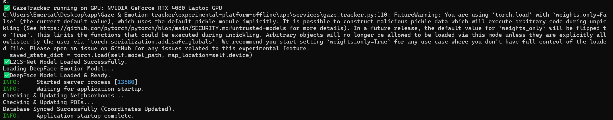
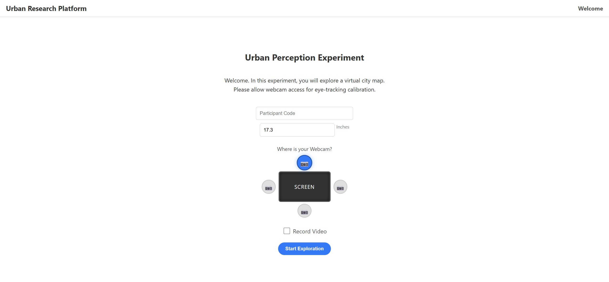
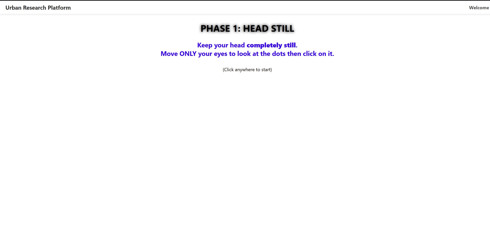
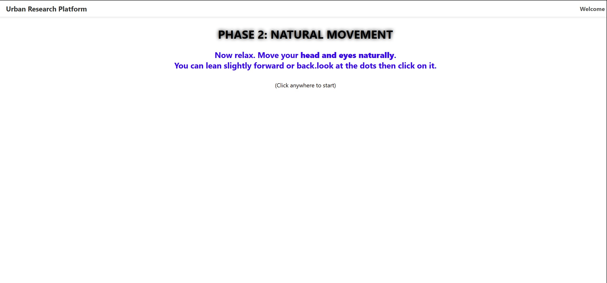
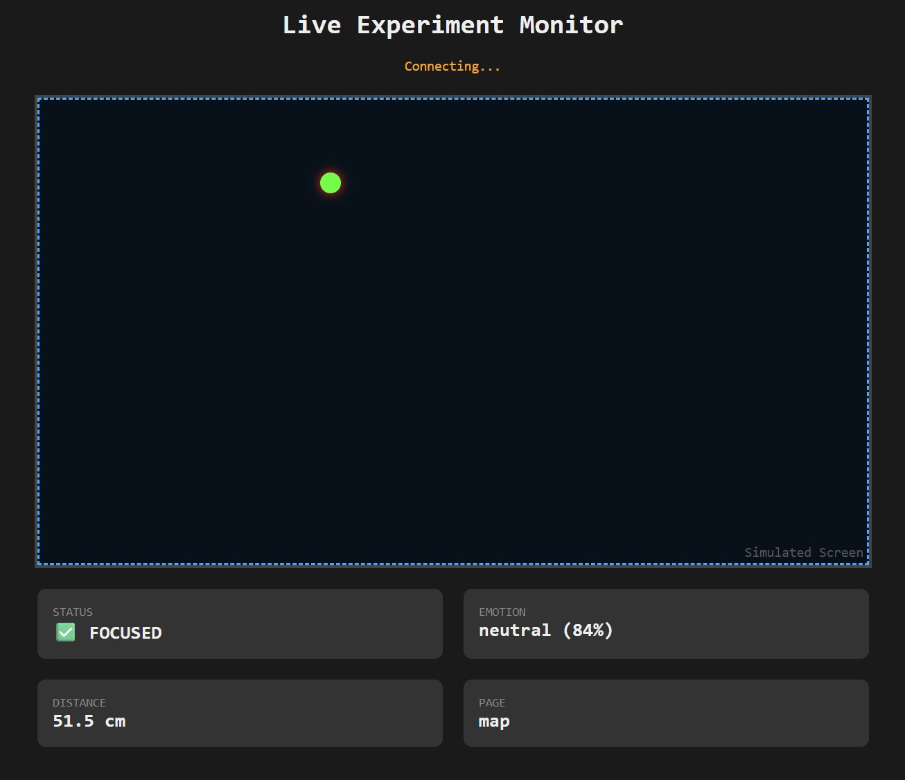
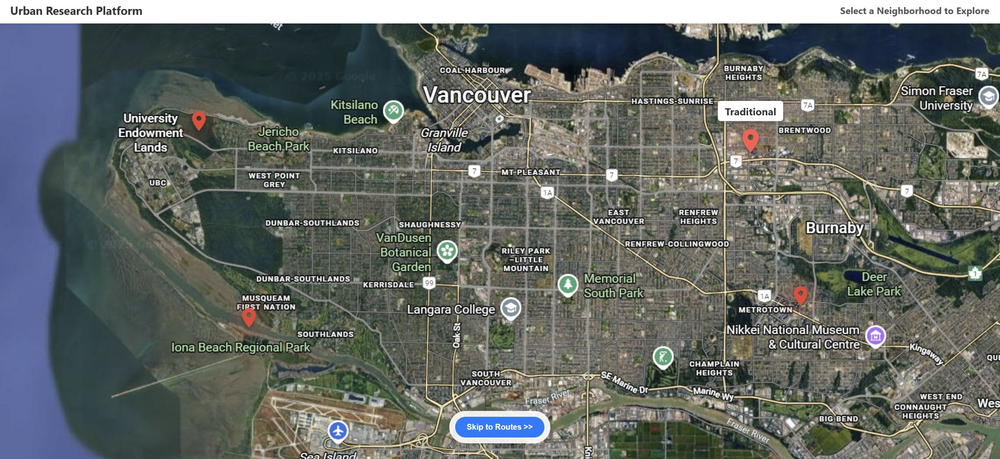
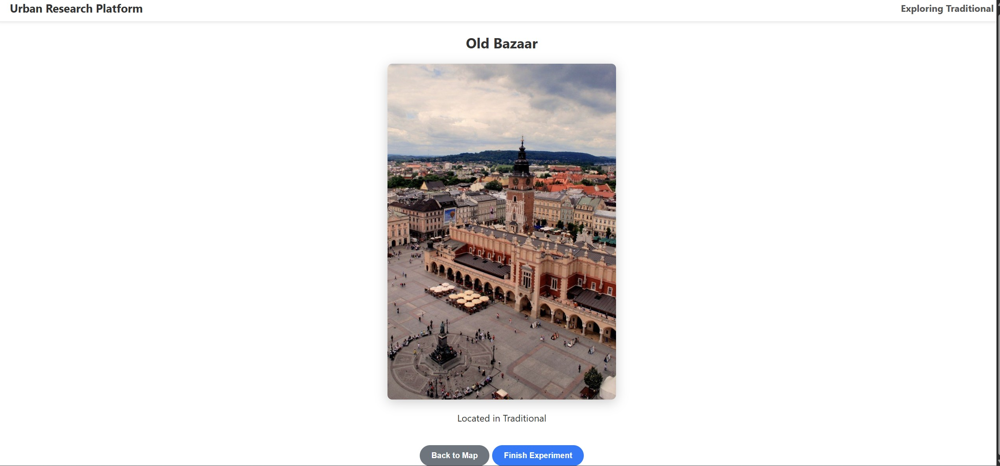
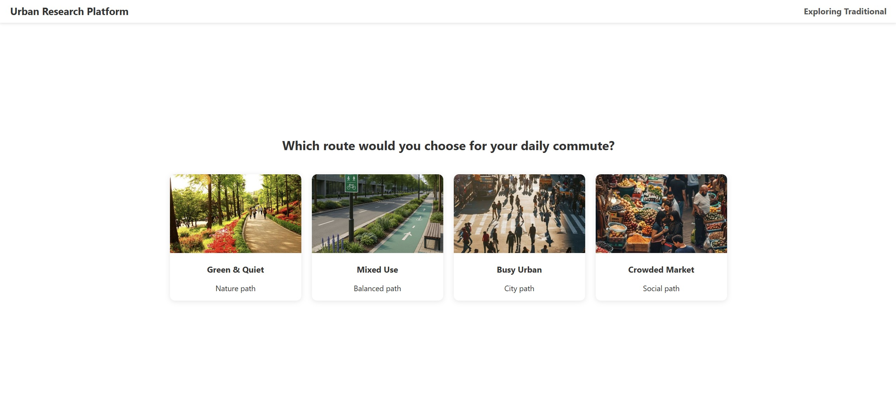

# Urban-Affect Platform (Prototype v3.0)

**An Experimental Platform for Measuring Human-Nature Interaction in Urban Spaces using Computer Vision.**

## 1. Scientific Context & Motivation
This project is a **Proof of Concept (PoC)** developed to bridge the gap between **Urban Design** and **Behavioral Data**. Traditional observation methods (like UAVs or Surveys) capture *macro-scale* movements or stated preferences. This platform aims to capture the **micro-scale psychological responses** (Visual Attention & Emotion) of citizens.

Drawing inspiration from the *"XS to XL Urban Nature"* framework and the *"Empty Parks"* phenomenon, this tool allows researchers to objectively measure how users interact with different scales of urban greenery versus built infrastructure by analyzing biological signals (Eye Gaze & Facial Affect) instead of subjective survey responses.

---
## 2. Key Capabilities
This is an advanced offline experimental platform designed for rigorous data collection:

- **Interactive Map Interface:** Users navigate a simulated city map, zoom into neighborhoods, and explore locations naturally.
- **High-Precision Gaze Tracking:** Uses **L2CS-Net (ResNet50)** for state-of-the-art 3D gaze estimation to measure "Time to First Fixation".
- **Real-Time Emotion Recognition:** Integrates **DeepFace** to analyze micro-expressions (Happiness, Stress, Neutrality) continuously every 200ms.
- **Context-Aware Tracking:** Intelligently detects if the user is looking at the screen, off-monitor, or outside the browser window.
- **Hesitation Analysis:** Automatically detects and reports when users hover over pins or hesitate before clicking (indicator of cognitive load).
- **Live Researcher Dashboard:** A real-time WebSocket-based monitor for researchers.
- **GPU Acceleration:** Fully optimized for NVIDIA RTX GPUs (using CUDA) for real-time inference without lag.

---
## 3. Tech Stack
- **Language:** Python 3.10+
- **Backend:** FastAPI, SQLAlchemy (SQLite)
- **AI Core:** PyTorch (CUDA), DeepFace, MediaPipe, L2CS-Net
- **Frontend:** HTML5, CSS3, Vanilla JavaScript (Map-based UI)
- **Communication:** WebSockets (Live Dashboard), REST API

---
## 4. Installation & Usage

### Prerequisites
- Python 3.10 or higher
- **Recommended:** NVIDIA GPU with CUDA support (for optimal performance).

### Step-by-Step Installation

**1. Clone the repository:**
```bash
git clone https://github.com/mohammad-mehrabi-habibabadi/urban-nature-Gaze-Emotion-tracker.git
```
**2. Create a Virtual Environment (Recommended)**
It is highly recommended to create a virtual environment to manage dependencies.
Activate the environment based on your operating system (Windows or Mac/Linux). 
```bash
python -m venv venv
```
# Windows:
```bash
venv\Scripts\activate
```
# Mac/Linux:
```bash
source venv/bin/activate
```

**3. Install Dependencies**
Install the required packages listed in the requirements file.
```bash
pip install -r requirements.txt
```

**4. [CRITICAL] Install PyTorch with CUDA (NVIDIA GPU Support)**
By default, standard installation methods might install the CPU version of PyTorch. To enable GPU acceleration for real-time tracking, you must uninstall the default version and explicitly install the CUDA-enabled version compatible with your specific GPU drivers. 
```bash
pip uninstall torch torchvision torchaudio
```
```bash
pip install torch torchvision torchaudio --index-url https://download.pytorch.org/whl/cu121
```
*(Note: If you do not have an NVIDIA GPU, you can skip this step. The platform will automatically default to CPU, though performance may be slower).*

**5. Download Model Weights**
The L2CS-Net model required for gaze estimation is large (~100MB). You have two options to get it:

* **Option A: Automated Download (Recommended)**
    Run the setup script provided to download the weights automatically:
    ```bash
    python setup_models.py
    ```

* **Option B: Manual Download**
    If the automated script fails, you can download the model manually from the original source:
    1.  Visit the official [L2CS-Net Repository](https://github.com/Ahmednull/L2CS-Net?tab=readme-ov-file).
    2.  Download the pre-trained weight file (named `L2CSNet_gaze360.pkl`).
    3.  Move the downloaded file into the `app/services/` directory.


**6. Database Initialization**
The system is designed to automatically create the database and populate necessary map coordinates on the first run. Ensure you delete any existing database files if you wish to start a fresh test.

## Running the Experiment

**7. Start the Server**
Run the main application script:
```bash
python main.py
```
1. You should see `✅ GazeTracker running on GPU` in the terminal logs.
2. You should see `✅L2CS-Net Model Loaded Successfully.` in the terminal logs.
3. You should see `✅DeepFace Model Loaded & Ready.` in the terminal logs.

**8. Access the Interface**
1. **Participant View:** Open `http://localhost:8000` in your browser.
2. **Researcher Live Dashboard:**
   Open a browser on the same device to monitor gaze and emotions in real-time.:
   `http://localhost:8000/dashboard.html`

   *Status Indicators:*
   - ✅ **FOCUSED:** User is looking at the browser.
   - ⚠️ **OUTSIDE BROWSER:** User is looking at the monitor but outside the experiment window.
   - ⚠️ **OFF MONITOR:** User is looking away from the screen entirely.

3. **Remote Access (Optional):**
   To access the Researcher Live dashboard from another device (e.g., mobile phone, laptop) on the same Wi-Fi:
   
   **A. Find Your Computer’s Local IP:**
      - Open Command Prompt -> Run `ipconfig`
      - Look for "IPv4 Address" (e.g., `192.168.1.5`)
   
   **B. Access URL:**
      Replace `localhost` with your IP: `http://192.168.X.X:8000/dashboard.html`
   
   **C. Firewall Settings (If it doesn't load):**
      - Ensure both devices are on the same **Private Network** (not Guest).
      - Temporarily disable Windows Firewall or create an Inbound Rule for port 8000.
---
## 5. Outputs & Data Export

The platform generates comprehensive datasets for analysis. Run the export script after an experiment:
```bash
python export_data.py
```

### Generated Reports:
* **`analysis_report.txt`**: Narrative report of user behavior and hesitation analysis.
* **`data_participants.csv`**: Demographics and session info.
* **`data_events_full.csv`**: Raw time-series data (Gaze coordinates, Emotion scores, Mouse events).
* **`data_sessions.csv`**: Session start/end times.

---
## 6.Visual Guide & Walkthrough

### 1. Server Startup & Health Check

> **What to check:** Ensure that `L2CS-Net` and `DeepFace` models are loaded successfully. If you have a GPU, look for the "✅ GazeTracker running on GPU" message.

### 2. Participant Onboarding

> **Instructions:** Enter the Participant Code. **Crucial:** accurately input the monitor size (in inches) and select the physical position of the webcam relative to the screen. This ensures the geometry logic calculates the gaze point correctly.

### 3. AI Calibration (Eye-Tracking)


> **Process:** > * **Phase 1 (Head Still):** The user must keep their head completely still and follow the dot with their eyes only.
> * **Phase 2 (Natural Movement):** The user should move naturally (lean forward/back) to help the AI compensate for depth and head pose changes.

### 4. Researcher Dashboard (Real-Time Monitoring)

> **Researcher View:** While the participant is doing the experiment, open `http://localhost:8000/dashboard.html` on a second screen. You can see the user's estimated gaze point (red dot), their current emotion, and attention status (Focused vs. Distracted).

### 5. Experiment Flow: City Exploration


> **Task:** The user explores the simulated city, clicking on pins to enter different neighborhoods (Traditional, Modern, Luxury, Mixed) and viewing specific Points of Interest (POIs).

### 6. Final Decision (Route Choice)

> **Conclusion:** After exploring, the user is presented with four route options. Their choice is correlated with the behavioral data collected during the session.

### 7. Automated Behavioral Report

> **Output:** Running `export_data.py` generates a narrative report. It automatically highlights "Hesitation" moments (e.g., hovering over a choice for 2s while frowning) and summarizes attention spans.

---
## 7. Project Structure & File Descriptions

### Root Directory
* `main.py`: The entry point. Initializes the database and launches the FastAPI server.
* `export_data.py`: Converts the SQLite database into CSV files and generates a narrative text report.
* `setup_models.py`: Automates the downloading of heavy AI model weights.
* `aoi_helper.py`: Helper logic for calculating "Area of Interest" (AOI) for gaze analysis.

### App Directory (`app/`)

* **`api/` (The Communication Layer):**
    * **`routes/`**: Contains the endpoints that the frontend talks to.
        * `events.py`: Receives logs like clicks, mouse moves, and gaze data to save to the DB.
        * `sessions.py`: Handles creating new participants, session management, and calibration data.
        * `stimuli.py`: Sends the list of map images, neighborhoods, and routes to the frontend.
    * **`websockets.py`**: Powers the Live Dashboard by streaming data in real-time to the researcher's monitor.

* **`core/` (Configuration):**
    * `config.py`: Stores global settings like the project name and database URL. It’s a central place to change settings without hunting through code.

* **`cv/` (Computer Vision):**
    * `camera_manager.py`: Manages the webcam. It handles opening the camera safely and reading frames in a thread-safe way (so the AI and the Video Recorder don't fight over the camera).
    * `mediapipe_pipeline.py`: A wrapper around Google's MediaPipe. It extracts the 468 facial landmarks needed for gaze tracking.

* **`db/` (Database):**
    * `session.py`: Handles connecting to the SQLite database.
    * `init_db.py`: The Setup Script. It creates the database tables and populates the initial data (Map images, coordinates, Pin names).

* **`factory/`**:
    * `app_factory.py`: Assembles the FastAPI application. It includes the routers, middleware (CORS), and mounts the static files.

* **`models/` (Data Structure):**
    * Defines the "Shape" of your data for the database.
    * `event.py`: The massive table that stores every click, gaze point, and emotion.
    * `stimulus.py`: Stores the map configurations (coordinates of pins, image paths).
    * `participant.py`: Stores user codes.
    * `session.py`: Stores start/end times.

* **`services/` (The AI Brain):**
    * **`experiment_logic.py` (The Conductor):** It runs a background thread that constantly grabs a frame from the camera, passes it to the AI models, and saves the results.
    * **`gaze_tracker.py` (The Gaze Engine):** It contains the L2CS-Net neural network and the math (Ray Casting) to figure out where on the screen the user is looking.
    * **`emotion_detector.py` (The Psychologist):** It uses DeepFace to analyze the facial expression and decides if the user is Happy, Focused, or Neutral.

* **`static/` (The Frontend / User Interface):**
    * `index.html`: The main page the participant sees.
    * `dashboard.html`: The page the researcher sees to monitor the experiment live.
    * `css/style.css`: Controls the look and feel (colors, layout, animations).
    * `js/main.js`: The Frontend Logic. It handles the map navigation, showing pins, recording mouse movements, and the calibration sequence.
    * `img/`: Stores the actual images for the maps, routes, and background.

---

## 8. Troubleshooting

* **Slow Performance:** If the terminal says `GazeTracker running on: cpu`, it means PyTorch is not using your GPU. Please refer to Step 4 of the installation to install the CUDA version.
* **Inverted Gaze:** Webcams often mirror the image. The code in `gaze_tracker.py` includes logic to fix this, but lighting conditions may affect accuracy.
* **Download Errors:** If `setup_models.py` fails, check your internet connection or install gdown manually: `pip install gdown`.
* **WebSocket Error:** If the dashboard stays on "Connecting...", ensure you are using the correct IP address and that no VPN is active.

---

## Acknowledgements

This project utilizes state-of-the-art open-source research:
* **L2CS-Net** for Gaze Estimation (Ahmed et al.).
* **DeepFace** for Emotion Analysis (Serengil et al.).

**Author:** Mohammad Mehrabi

